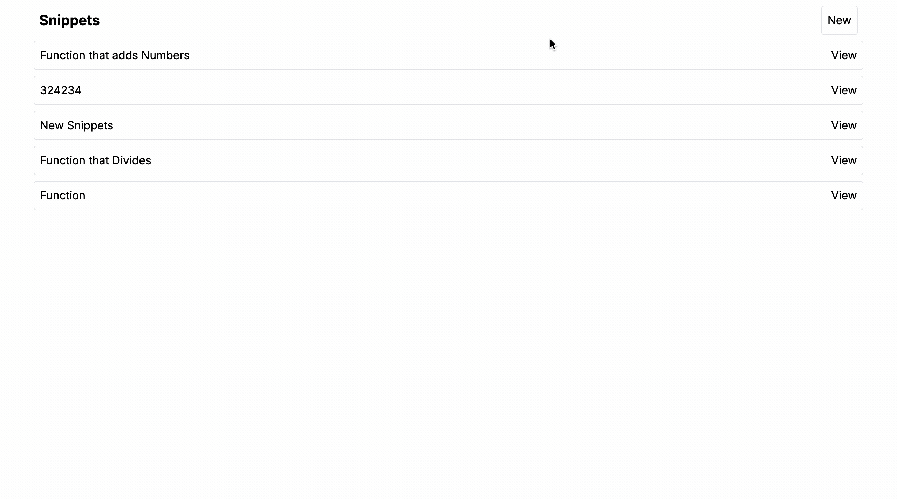

<div align="center">
<h1>Snippet App</h1>



</div>

## 📋 <a name="table">Table of Contents</a>

1. 🤖 [Introduction](#introduction)
2. ⚙️ [Tech Stack](#tech-stack)
3. 🎮 [Get Started](#get-started)
4. 🛠️ [Improvements Ideas](#improvements)

## <a name="introduction">🤖 Introduction</a>

This multi-page app is designed with advanced functions to empower users to add, edit, and delete snippets. It utilizes cutting-edge technologies such as Monaco Editor, Prisma (ORM), TypeScript, and TailwindCSS within the Next.js framework.

## <a name="tech-stack">⚙️ Tech Stack</a>

- HTML
- Tailwind CSS
- NextJS
- TypeScript
- Prisma

## <a name="get-started">🎮 Get Started</a>

First, run the development server:

```bash
npm run dev
# or
yarn dev
# or
pnpm dev
# or
bun dev
```

Open [http://localhost:3000](http://localhost:3000) with your browser to see the result.

You can start editing the page by modifying `app/page.tsx`. The page auto-updates as you edit the file.

This project uses [`next/font`](https://nextjs.org/docs/basic-features/font-optimization) to automatically optimize and load Inter, a custom Google Font.

### Learn More

To learn more about Next.js, take a look at the following resources:

- [Next.js Documentation](https://nextjs.org/docs) - learn about Next.js features and API.
- [Learn Next.js](https://nextjs.org/learn) - an interactive Next.js tutorial.

You can check out [the Next.js GitHub repository](https://github.com/vercel/next.js/) - your feedback and contributions are welcome!

### Deploy on Vercel

The easiest way to deploy your Next.js app is to use the [Vercel Platform](https://vercel.com/new?utm_medium=default-template&filter=next.js&utm_source=create-next-app&utm_campaign=create-next-app-readme) from the creators of Next.js.

Check out our [Next.js deployment documentation](https://nextjs.org/docs/deployment) for more details.

## <a name="improvements">🛠️ Improvements Ideas</a>

- Fix issue with Prisma on Vercel homepage so it can be deployed
